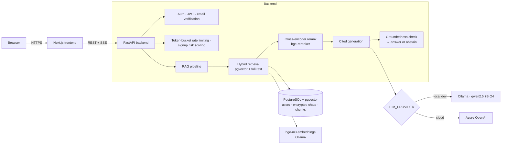
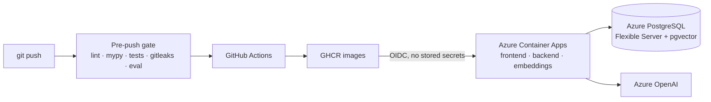

# SecRAG — a production-minded RAG assistant for OWASP security guidance

[](https://github.com/davidmorgadocarames/rag_app/actions/workflows/ci.yml)
[](https://github.com/davidmorgadocarames/rag_app/actions/workflows/cd.yml)

SecRAG answers questions about the OWASP Top 10 and Cheat Sheets from a **versioned corpus
of official documents**. Every answer cites its sources, and when the corpus doesn't
support an answer, SecRAG **abstains instead of guessing**. It is a complete full-stack
product: authentication, rate limiting, GDPR-grade data erasure, an evaluation gate that
blocks regressions, containers, CI/CD and a cloud deployment on Azure. It is built to show
how a RAG system is engineered for production, not just prototyped.

## Why this project

Most RAG demos stop at "retrieve, then generate". The hard problems start after that, and
this project is built around them:

- **Answers that are faithful but outdated.** OWASP guidance changes between editions.
  Injection, for example, is A1 in 2017, A03 in 2021 and A05 in 2025. An answer can quote
  the corpus accurately and still be wrong for the edition you asked about. SecRAG makes
  retrieval version-aware and evaluates **correctness against an independent ground
  truth**, not only faithfulness to the retrieved text.
- **Honest abstention.** A groundedness check runs after generation. If the corpus doesn't
  back an answer, the system says so instead of hallucinating.
- **Evaluation as a release gate.** Retrieval and generation are measured separately
  against thresholds and a stored baseline. Every push runs the eval gate, and a
  regression blocks the push before CD can deploy it.
- **Security and abuse resistance.** The app has its own auth (argon2 + JWT + email
  verification) and cost-aware token-bucket rate limiting against brute force and
  Denial-of-Wallet. Signup risk scoring resists Sybil abuse, and the pipeline defends
  against indirect prompt injection.
- **Privacy by design.** Each user's data is encrypted with a per-user key. Erasing an
  account hard-deletes the data and **crypto-shreds** the key. Tombstones let the
  deletions be replayed after any restore from backup
  ([ADR 0002](docs/adr/0002-data-erasure-gdpr.md)).
- **Engineering discipline.** A written Definition of Done is enforced by a pre-push gate
  covering lint, strict typing, tests, secret scanning, the frontend build and evals.
  Architecture decisions are recorded as ADRs.

### Current evaluation baseline

| Retrieval recall | Faithfulness | Correctness vs ground truth | Correct abstention |
|:---:|:---:|:---:|:---:|
| 1.0 | 1.0 | 0.9 | 1.0 |

## Architecture



- **Ingestion:** official OWASP PDFs and Markdown are normalized to Markdown by a
  layout-aware parser, then split into version-tagged chunks.
- **Retrieval:** a hybrid of dense vectors (HNSW) and full-text search, reranked by a
  cross-encoder. The top-N passages go to the LLM as numbered context.
- **Generation:** the answer cites the numbered context, then passes a groundedness check.
  Chat is streamed over Server-Sent Events, showing each pipeline stage and the answer
  token by token, and conversations are stored encrypted.
- **Pluggable LLM:** a `ChatClient` interface lets the same code run on free local models
  in development (Ollama + qwen on a GPU) or on Azure OpenAI in the cloud.
- **Agentic routing was benchmarked and rejected.** An LLM router added latency without
  improving quality, so the pipeline stays deterministic
  ([ADR 0001](docs/adr/0001-agentic-router.md)).

### Deployment



## Tech stack

| Layer | Technology |
|---|---|
| Frontend | Next.js 15, React 19, TypeScript, Tailwind CSS |
| Backend | Python 3.12, FastAPI, SQLAlchemy 2, Alembic, pydantic-settings |
| Database | PostgreSQL 16 + pgvector (HNSW) + full-text search |
| LLM | Ollama `qwen2.5:7b-instruct` (local) · Azure OpenAI `gpt-4.1-mini` (cloud) |
| Embeddings / reranking | `bge-m3` · `BAAI/bge-reranker-v2-m3` (cross-encoder) |
| Security | argon2, JWT, Fernet envelope encryption (crypto-shred), token bucket |
| Evaluation | Separate retrieval and generation metrics, LLM judge, regression gate |
| Quality | ruff, mypy `--strict`, pytest, ESLint, `tsc`, pre-commit, gitleaks |
| Delivery | Docker, Docker Compose, GitHub Actions, GHCR, Azure Container Apps (OIDC) |

## Getting started

### Choose your environment

| Option | Use it when | Notes |
|---|---|---|
| **WSL2 / Linux (recommended)** | You want to develop and push | Clone into the Linux filesystem (`~/...`), **not** `/mnt/c`. File I/O is much faster and CUDA works with Ollama. The pre-push gate **requires** WSL2/Linux. |
| **Windows (native)** | You only want to run the app | Everything runs, but pushes are blocked by the gate. Use the PowerShell commands where shown. |
| **Docker only** | You want to try it without installing Python or Node | See [Run everything with Docker](#run-everything-with-docker). |

**Prerequisites:** Git, Docker, **Python 3.12** (3.11 works; avoid 3.13+, since some ML
wheels are not yet available for it), **Node 20+** and [Ollama](https://ollama.com).
An NVIDIA GPU is strongly recommended for the local LLM.

### 1. Clone

```bash
git clone https://github.com/davidmorgadocarames/rag_app.git
cd rag_app
```

### 2. Start the infrastructure and pull the models

```bash
docker compose up -d db                        # PostgreSQL 16 + pgvector on :5432
ollama serve &                                 # or run Ollama as a desktop app / service
ollama pull bge-m3                             # embeddings
ollama pull qwen2.5:7b-instruct-q4_K_M         # chat model
```

If you don't want to install Ollama on the host, `docker compose up -d db ollama` runs it
in a container instead (GPU passthrough needs `nvidia-container-toolkit`). Pull the models
with `docker compose exec ollama ollama pull <model>`. Run only one Ollama at a time,
since both listen on port 11434.

### 3. Backend: virtual environment and configuration

**WSL2 / Linux / macOS**

```bash
cd backend
python3.12 -m venv .venv                       # or: uv venv --python 3.12 .venv
source .venv/bin/activate
pip install -r requirements-dev.txt            # includes torch for the reranker
export PYTHONPATH=src
cp ../.env.example .env                        # the backend reads backend/.env
```

**Windows (PowerShell)**

```powershell
cd backend
py -3.12 -m venv .venv
.\.venv\Scripts\Activate.ps1
pip install -r requirements-dev.txt
$env:PYTHONPATH = "src"
Copy-Item ..\.env.example .env
```

Fill in two required secrets in `backend/.env` (it is git-ignored and must never be committed):

```bash
python -c "import secrets; print('JWT_SECRET=' + secrets.token_urlsafe(64))"
python -c "from cryptography.fernet import Fernet; print('DATA_MASTER_KEY=' + Fernet.generate_key().decode())"
```

SMTP is optional. Without it, email-verification links are written to the backend log.

### 4. Build the corpus and the index

All commands below run from `backend/` with the virtual environment active.

```bash
python ../scripts/fetch_corpus.py              # download the official OWASP documents → data/
python -m rag_app.ingestion --data-dir ../data # PDF/MD → normalized Markdown → chunks.jsonl
alembic upgrade head                           # schema: pgvector, HNSW, full-text, auth tables
python -m rag_app.indexing                     # embed chunks with bge-m3 → pgvector
```

Try it from the command line:

```bash
python -m rag_app.retrieval "What rank is Injection?" --version 2025
python -m rag_app.generation "How do I prevent SQL injection?"            # cited answer
python -m rag_app.generation "How do I configure a Cisco ASA firewall?"   # abstains
```

### 5. Run the API

```bash
uvicorn rag_app.api.app:app --host 0.0.0.0 --port 8000   # Swagger UI at http://localhost:8000/docs
```

### 6. Run the frontend

In a second terminal:

```bash
cd frontend
npm install
npm run dev                                    # http://localhost:3000
```

The frontend calls `http://localhost:8000` by default. To use a different backend, set
`NEXT_PUBLIC_API_URL` (it is read at build time).

### 7. Tests, quality checks and the eval gate

```bash
# from backend/ (venv active)
pytest
ruff check . && mypy
python -m rag_app.eval.gate                    # fails if metrics drop below thresholds/baseline
python -m rag_app.eval.gate --update-baseline  # only after an intended quality change

# from frontend/
npm run lint && npm run typecheck && npm run build
```

To contribute, enable the hooks once from the repo root:

```bash
pre-commit install                             # lint/format/secret scan on every commit
git config core.hooksPath .githooks            # full phase gate on every push (WSL2/Linux)
bash scripts/gate.sh                           # run the same gate manually
```

### Run everything with Docker

```bash
docker compose up -d db ollama
docker compose exec ollama ollama pull bge-m3
docker compose exec ollama ollama pull qwen2.5:7b-instruct-q4_K_M
JWT_SECRET=... DATA_MASTER_KEY=... docker compose up -d --build   # backend :8000 + frontend :3000
```

The backend container applies its migrations on startup. To build the index, run the
ingestion and indexing steps from [step 4](#4-build-the-corpus-and-the-index) against the
same database.

## API at a glance

| Endpoint | Purpose |
|---|---|
| `POST /auth/register` · `POST /auth/login` · `GET /auth/me` | Account creation (risk-scored), login (rate-limited), current user |
| `GET /auth/verify` · `POST /auth/resend-verification` | Email verification |
| `POST /chat/stream` | Authenticated SSE stream: pipeline stages, answer tokens, citations, token usage |
| `POST /chat` | One-shot, non-persisting answer with citations and `abstained`/`grounded` flags |
| `GET/PATCH/DELETE /conversations…` | Encrypted conversation history |
| `DELETE /account` | GDPR erasure: hard delete, crypto-shred and tombstone |

## Architecture decision records

- [ADR 0001 — Agentic router: benchmarked, not adopted](docs/adr/0001-agentic-router.md)
- [ADR 0002 — Data erasure (GDPR): crypto-shred + tombstones](docs/adr/0002-data-erasure-gdpr.md)
- [ADR 0003 — Containerization and delivery](docs/adr/0003-deployment.md)
- [ADR 0004 — Cloud deployment on Azure](docs/adr/0004-cloud-deployment-azure.md)

## License

TBD.
