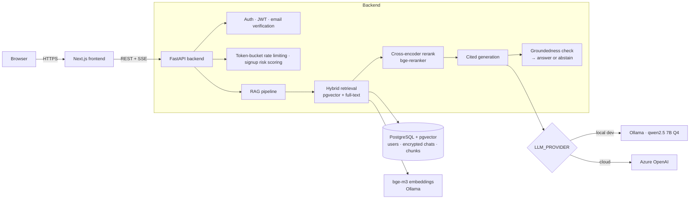
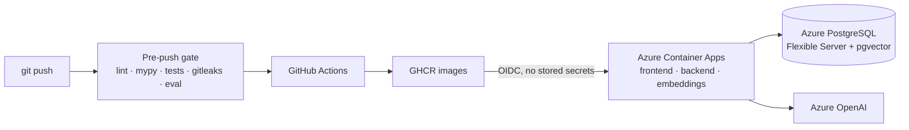

# SecRAG — a production-minded RAG assistant for OWASP security guidance

[](https://github.com/davidmorgadocarames/rag_app/actions/workflows/ci.yml)
[](https://github.com/davidmorgadocarames/rag_app/actions/workflows/cd.yml)
[](LICENSE)

SecRAG answers questions about the OWASP Top 10 and Cheat Sheets from a **versioned corpus
of official documents**. Every answer cites its sources, and when the corpus doesn't
support an answer, SecRAG **abstains instead of guessing**. It is a complete full-stack
product: authentication, rate limiting, GDPR-grade data erasure, an evaluation gate that
blocks regressions, containers, CI/CD and a cloud deployment on Azure. It is built to show
how a RAG system is engineered for production, not just prototyped.

## Why this project

Most RAG demos stop at "retrieve, then generate". The hard problems start after that, and
this project is built around them:

- **Answers that are faithful but outdated.** OWASP guidance changes between editions.
  Injection, for example, is A1 in 2017, A03 in 2021 and A05 in 2025. An answer can quote
  the corpus accurately and still be wrong for the edition you asked about. SecRAG makes
  retrieval version-aware and evaluates **correctness against an independent ground
  truth**, not only faithfulness to the retrieved text.
- **Honest abstention.** A groundedness check runs after generation. If the corpus doesn't
  back an answer, the system says so instead of hallucinating.
- **Evaluation as a release gate.** Retrieval and generation are measured separately
  against thresholds and a stored baseline. Every push to `main` runs the eval gate in an
  isolated gate stack, and a regression blocks the push before CD can deploy it.
- **Security and abuse resistance.** The app has its own auth (argon2 + JWT + email
  verification) and cost-aware token-bucket rate limiting against brute force and
  Denial-of-Wallet. Signup risk scoring resists Sybil abuse, and the pipeline defends
  against indirect prompt injection.
- **Privacy by design.** Each user's data is encrypted with a per-user key. Erasing an
  account hard-deletes the data and **crypto-shreds** the key. Tombstones let the
  deletions be replayed after any restore from backup
  ([ADR phase 6](docs/adr/adr_phase06_gdpr_erasure.md)).
- **Engineering discipline.** A written Definition of Done is enforced by a pre-push gate
  covering lint, strict typing, tests (including DB tests on a throw-away database), secret
  scanning, dependency audit, the frontend build and evals.
  Architecture decisions are recorded as ADRs.

### Current evaluation baseline

| Retrieval recall | Faithfulness | Correctness vs ground truth | Correct abstention |
|:---:|:---:|:---:|:---:|
| 1.0 | 1.0 | 0.9 | 1.0 |

## Architecture


```mermaid
flowchart LR
    U[Browser] -->|HTTPS| FE[Next.js frontend]
    FE -->|REST + SSE| API[FastAPI backend]

    subgraph Backend
      API --> AUTH[Auth · JWT · email verification]
      API --> RL[Token-bucket rate limiting · signup risk scoring]
      API --> RAG[RAG pipeline]
      RAG --> R1[Hybrid retrieval<br/>pgvector + full-text]
      R1 --> R2[Cross-encoder rerank<br/>bge-reranker]
      R2 --> R3[Cited generation]
      R3 --> R4[Groundedness check<br/>→ answer or abstain]
    end

    R1 --> DB[(PostgreSQL + pgvector<br/>users · encrypted chats · chunks)]
    R1 --> EMB[bge-m3 embeddings<br/>Ollama]
    R3 --> LLM{LLM_PROVIDER}
    LLM -->|local dev| OLL[Ollama · qwen2.5 7B Q4]
    LLM -->|cloud| AOAI[Azure OpenAI]
```

- **Ingestion:** official OWASP PDFs and Markdown are normalized to Markdown by a
  layout-aware parser, then split into version-tagged chunks.
- **Retrieval:** a hybrid of dense vectors (HNSW) and full-text search, reranked by a
  cross-encoder. The top-N passages go to the LLM as numbered context.
- **Generation:** the answer cites the numbered context, then passes a groundedness check.
  Chat is streamed over Server-Sent Events, showing each pipeline stage and the answer
  token by token, and conversations are stored encrypted.
- **Pluggable LLM:** a `ChatClient` interface lets the same code run on free local models
  in development (Ollama + qwen on a GPU) or on Azure OpenAI in the cloud.
- **Agentic routing was benchmarked and rejected.** An LLM router added latency without
  improving quality, so the pipeline stays deterministic
  ([ADR phase 5](docs/adr/adr_phase05_agentic_router.md)).

### Deployment


```mermaid
flowchart LR
    DEV[git push] --> GATE[Pre-push gate<br/>lint · mypy · tests · gitleaks · eval]
    GATE --> GH[GitHub Actions]
    GH --> GHCR[GHCR images]
    GHCR -->|OIDC, no stored secrets| ACA[Azure Container Apps<br/>frontend · backend · embeddings]
    ACA --> PG[(Azure PostgreSQL<br/>Flexible Server + pgvector)]
    ACA --> AOAI[Azure OpenAI]
```

## Tech stack

| Layer | Technology |
|---|---|
| Frontend | Next.js 15, React 19, TypeScript, Tailwind CSS |
| Backend | Python 3.12, FastAPI, SQLAlchemy 2, Alembic, pydantic-settings |
| Database | PostgreSQL 16 + pgvector (HNSW) + full-text search |
| LLM | Ollama `qwen2.5:7b-instruct` (local) · Azure OpenAI `gpt-4.1-mini` (cloud) |
| Embeddings / reranking | `bge-m3` · `BAAI/bge-reranker-v2-m3` (cross-encoder) |
| Security | argon2, JWT, Fernet envelope encryption (crypto-shred), token bucket |
| Evaluation | Separate retrieval and generation metrics, LLM judge, regression gate |
| Quality | ruff, mypy `--strict`, pytest, ESLint, `tsc`, pre-commit, gitleaks |
| Delivery | Docker, Docker Compose, GitHub Actions, GHCR, Azure Container Apps (OIDC) |

## Getting started

### Choose your environment

| Option | Use it when | Notes |
|---|---|---|
| **WSL2 / Linux (recommended)** | You want to develop and push | Clone into the Linux filesystem (`~/...`), **not** `/mnt/c`. File I/O is much faster and CUDA works with Ollama. The pre-push gate **requires** WSL2/Linux. |
| **Windows (native)** | You only want to run the app | Everything runs, but pushes are blocked by the gate. Use the PowerShell commands where shown. |
| **Docker only** | You want to try it without installing Python or Node | See [Run everything with Docker](#run-everything-with-docker). |

**Prerequisites:** Git, Docker, **Python 3.12** (3.11 works; avoid 3.13+, since some ML
wheels are not yet available for it), **Node 22 (≥ 22.13) with npm 11** and
[Ollama](https://ollama.com). An NVIDIA GPU is strongly recommended for the local LLM.

**Contributor toolchain (WSL2).** The gate and the operations scripts also need the
PostgreSQL 16 client (`psql`/`pg_dump`), `age`, `shellcheck`, `jq`, the GitHub CLI and the Linux
Azure CLI. One script installs all of them as user binaries (no `sudo`) under
`~/.local/opt`, with entry points in `~/.local/bin`; another prints every prerequisite as
OK / KO / PENDING (PENDING = a login or a repository/Azure setting that only the owner can do):

```bash
bash scripts/prereqs/install.sh    # pinned versions, verified, atomic, idempotent
bash scripts/prereqs/check.sh      # exit 0 only when every item is OK
```

Every download is pinned and checked against a SHA-256 (npm packages through npm's own
registry integrity check). The Linux Azure CLI and all of its Python dependencies install
from a committed hashed lock file (`scripts/prereqs/azure-cli.lock.txt`, installed with
`--require-hashes`) into a venv on a pinned uv-managed Python; bumping it is a deliberate
change (`install.sh --lock-az`, steps in the script header). The Linux CLI keeps its own
config and token cache in `~/.azure-linux` — never in a Windows profile reached through
`~/.azure`, nor on any Windows drive (the wrapper refuses a config dir under `/mnt` or on a
9p/drvfs mount) — and `install.sh --link-az` makes it the default `az` in WSL; then log in
once with the browser flow, `BROWSER=explorer.exe az login --tenant <tenant>` (device-code
login is blocked by tenants with security defaults). The installer needs
[uv](https://docs.astral.sh/uv/) **≥ 0.12.17** (the version that generated the lock);
`check.sh` reports an older one as KO. A PGDG package that downloads but does not match its
pinned SHA-256 stops the installer (no silent fallback to the archive mirror).

Downloads use IPv4 only: from WSL2, IPv6 connections to the npm registry can hang. If
`npm install`/`npm ci` stalls, run it with `NODE_OPTIONS=--dns-result-order=ipv4first`.

### 1. Clone

```bash
git clone https://github.com/davidmorgadocarames/rag_app.git
cd rag_app
```

### 2. Start the infrastructure and pull the models

```bash
scripts/dev/create_dev_volume.sh               # once: the database volume (never recreated)
docker compose up -d db db-roles               # PostgreSQL 16 + pgvector on :5432, DB roles
ollama serve &                                 # or run Ollama as a desktop app / service
ollama pull bge-m3                             # embeddings
ollama pull qwen2.5:7b-instruct-q4_K_M         # chat model
```

The development database lives in one fixed Docker volume, `rag_ia_pgdata`, declared
`external` in `docker-compose.yml`: compose never creates or deletes it (not even with
`down -v`), and the data no longer depends on the folder you start compose from.

If you don't want to install Ollama on the host, `docker compose up -d db ollama` runs it
in a container instead (GPU passthrough needs `nvidia-container-toolkit`). Pull the models
with `docker compose exec ollama ollama pull <model>`. Run only one Ollama at a time,
since both listen on port 11434.

### 3. Backend: virtual environment and configuration

**WSL2 / Linux / macOS**

```bash
cd backend
python3.12 -m venv .venv                       # or: uv venv --python 3.12 .venv
source .venv/bin/activate
pip install -r requirements-dev.txt            # includes torch for the reranker
export PYTHONPATH=src
cp ../.env.example .env                        # the backend reads backend/.env
```

**Windows (PowerShell)**

```powershell
cd backend
py -3.12 -m venv .venv
.\.venv\Scripts\Activate.ps1
pip install -r requirements-dev.txt
$env:PYTHONPATH = "src"
Copy-Item ..\.env.example .env
```

Fill in two required secrets in `backend/.env` (it is git-ignored and must never be committed):

```bash
python -c "import secrets; print('JWT_SECRET=' + secrets.token_urlsafe(64))"
python -c "from cryptography.fernet import Fernet; print('DATA_MASTER_KEY=' + Fernet.generate_key().decode())"
chmod 600 .env                                 # secrets: owner-only (scripts/prereqs/check.sh checks it)
```

Keep **one** `DATA_MASTER_KEY` per database, and keep a copy in your password manager: every
user's data key is wrapped with it. Native runs read `backend/.env`; compose reads the shell or
a root `.env` — use the same key in both. The API checks this at start-up: it validates
`DATABASE_URL`, `JWT_SECRET` (≥ 32 characters) and `DATA_MASTER_KEY` (a Fernet key), and it
refuses to start when the key is not the one the database was initialised with (a stored
key fingerprint) — see [Recovering from a changed master key](#recovering-from-a-changed-master-key).

SMTP is optional. Without it, email-verification links are written to the backend log.

Keep `ENV=dev` (from `.env.example`) on a local machine. When `ENV` is unset the app assumes
`prod`, and in `prod` it refuses to start if any development-only feature flag is enabled.

### 4. Build the corpus and the index

All commands below run from `backend/` with the virtual environment active.

```bash
python ../scripts/fetch_corpus.py              # download the official OWASP documents → data/
python -m rag_app.ingestion --data-dir ../data # PDF/MD → normalized Markdown → chunks.jsonl
alembic upgrade head                           # schema (needs the db-roles step above)
python -m rag_app.indexing                     # embed chunks with bge-m3 → pgvector
```

Try it from the command line:

```bash
python -m rag_app.retrieval "What rank is Injection?" --version 2025
python -m rag_app.generation "How do I prevent SQL injection?"            # cited answer
python -m rag_app.generation "How do I configure a Cisco ASA firewall?"   # abstains
```

### 5. Run the API

```bash
uvicorn rag_app.api.app:app --host 0.0.0.0 --port 8000   # Swagger UI at http://localhost:8000/docs
```

### 6. Run the frontend

In a second terminal:

```bash
cd frontend
npm install
npm run dev                                    # http://localhost:3000
```

The frontend calls `http://localhost:8000` by default. To use a different backend, set
`NEXT_PUBLIC_API_URL` (it is read at build time).

### 7. Tests, quality checks and the eval gate

```bash
# from backend/ (venv active)
pytest                                         # unit tests; DB tests skip without TEST_DATABASE_URL
ruff check . && mypy
python -m rag_app.eval.gate                    # fails if metrics drop below thresholds/baseline
python -m rag_app.eval.gate --update-baseline  # only after an intended quality change

# from frontend/
npm run lint && npm run typecheck && npm run build
```

To contribute, enable the hooks once from the repo root:

```bash
pre-commit install                             # lint/format/secret scan on every commit
git config core.hooksPath .githooks            # phase gate on every push (WSL2/Linux)
```

**The phase gate** (`scripts/gate.sh`, rules in
[Definition of Done](docs/DEFINITION_OF_DONE.md)) has named steps with time budgets:

```bash
bash scripts/gate.sh --fast          # default: lint, types, unit tests, gitleaks, shellcheck,
                                     # schema-check, adr-links, frontend, dependency-audit
bash scripts/gate.sh --make-seed     # once (and when the corpus changes): build the gate seed
bash scripts/gate.sh --full          # fast + DB tests, migrations round trip, restart check
                                     # and eval, in isolated throwaway projects
bash scripts/gate.sh --only eval     # one or more steps (comma-separated); --list shows them
```

`--full` runs in its own Docker Compose project (`compose.gate.yml`: project `secrag-gate`,
volume `secrag_gate_pgdata`, database on `127.0.0.1:15432` only) and removes it at the end,
so it never touches the development database. It needs Docker and Ollama (native
`ollama serve`, or `GATE_OLLAMA_HOST`); anything unreachable fails the gate. DB tests use a
harness that creates a throw-away database and **refuses** the development one (port 5432 or
database `rag`). Pushing a phase branch runs `--fast`, pushing `main` runs `--full`, both
from a temporary worktree at the pushed commit; deleting a remote branch runs nothing.
A `--full` PASS on a clean tree publishes the commit status `secrag/gate-full` for that
commit; CD deploys `main` only after CI succeeded **and** that status is present.

### Run everything with Docker

The containers use a **native** Ollama (GPU, `ollama serve` in WSL2) by default:

```bash
ollama serve &                                   # listens on 127.0.0.1:11434 only
ollama pull bge-m3 && ollama pull qwen2.5:7b-instruct-q4_K_M
scripts/dev/create_dev_volume.sh                 # once
JWT_SECRET=... DATA_MASTER_KEY=... docker compose up -d --build   # db → roles → migrate → backend :8000, frontend :3000
```

The backend container reaches it as `host.docker.internal:11434`: Docker Desktop forwards
that to Windows' loopback, and WSL2's localhost forwarding relays it to Ollama's loopback
port inside WSL, so Ollama (which has no authentication) is never exposed on the network.
Every published port is bound to `127.0.0.1`. To use the containerised Ollama instead:
`docker compose --profile ci up -d` with `CONTAINER_OLLAMA_HOST=http://ollama:11434`.
A one-shot `db-roles` service applies `db/roles.sql` before the backend starts.
Compose reads its variables from the shell or from an optional repository-root `.env` (not
`backend/.env`, which compose does not read; keys in `.env.example`). The backend container
runs with `ENV=prod` unless `ENV=dev` is set there, so development-only features stay off
by default.

Migrations run **once per `up`** in the one-shot `migrate` service (the slim `jobs` image,
`backend/Dockerfile.jobs`: no torch, PostgreSQL 16 client, `age`), after `db-roles` and before
the backend; the backend image itself never migrates (on Azure the same image runs as a
migration Job that CD starts before updating the apps). To build the index, run the
ingestion and indexing steps from [step 4](#4-build-the-corpus-and-the-index) against the
same database.

### Recovering from a changed master key

If the API refuses to start because stored user keys do not unwrap with `DATA_MASTER_KEY`
(or `diag_keys.py` reports `KO > 0`), an older key may still exist (password manager, an old
`.env`, shell history). `scripts/azure/key_recovery.sh` tests candidate keys **without ever
printing, logging or storing them**:

```bash
scripts/azure/key_recovery.sh init             # ~/.secrag-recovery/candidates (dir 0700, file 0600)
nano ~/.secrag-recovery/candidates             # one key per line — never on the command line
# locally, against a throwaway copy of the database (PG* variables), or on Azure inside
# scripts/azure/db-tunnel.sh (read-only):
scripts/azure/key_recovery.sh check --accounts all --current-key-from-env-file backend/.env
# ... rewrap / erase (below); only when EVERY outcome is done — local and Azure:
scripts/azure/key_recovery.sh shred            # overwrite + delete the candidates
```

It prints the total (`accounts: N in total`) and only `account #i: candidate #j OK|KO`
lines; pass that `N` back as `--expect-total N` so a later command refuses if accounts were
added or erased in between. A match is re-wrapped under the current key with `rewrap` (dry
run by default; `--apply` only after a `pg_dump`). Keep the candidate file until both the
local and the Azure outcome are done (the Azure `rewrap` needs it too), then `shred`. On the
local development DB, an account that no key unwraps is erased with
`key_recovery.sh erase --account I --expect-total N --current-key-from-env-file backend/.env`
(dry run; then `--apply --i-have-a-snapshot`): in the same transaction it proves the current
key is the app's key (it must match the stored master-key fingerprint, if any, and unwrap at
least one *other* account — a wrong env file is refused), re-checks the current key and every
candidate on that account, and uses the app's own erasure path (tombstone). When no recovery
is attempted (no candidate file), `check` and `erase` take `--no-candidates` and there is
nothing to shred. It needs migration 0005 and never runs against Azure — there the owner
deletes the account in the app.
The full procedure is in
[ADR phase 11 — Key recovery](docs/adr/adr_phase11_stability.md#key-recovery-d-2026-09-29-2).

### Backups

Backups are `pg_dump` files encrypted with [age](https://age-encryption.org) to a **public**
key; only the owner holds the private key (password manager + an offline copy). Every copy
is kept at most **14 days** (one constant, `backend/src/rag_app/retention.py`). Erased
accounts stay erased after a restore: the tombstones are also exported outside the database,
and a restore applies them again before the app reopens.

```bash
# Encrypted dump as the read-only role secrag_backup (never inside a git work tree):
DATABASE_URL=postgresql://secrag_backup:…@127.0.0.1:5432/rag BACKUP_AGE_RECIPIENT=age1… \
  scripts/db/backup.sh --file                 # → ~/secrag-db-backups/secrag-<ts>.dump.age
# Weekly copy of the newest Azure Blob dump + tombstone export (Linux az, logged in):
BACKUP_STORAGE_ACCOUNT=<account> scripts/db/backup-pull.sh
# Restore into a NEW, EMPTY database as its owner (roles.sql applied on that server first):
RESTORE_DATABASE_URL=postgresql://<owner>:…@127.0.0.1:5432/<empty db> \
  scripts/db/restore.sh --dump secrag-<ts>.dump.age --identity <private key file> \
  --tombstones-dir <tombstone exports>
```

On Azure the backup Job runs `backup.sh --blob` daily (managed identity, no storage keys)
and fails if a dump older than 14 days is still there. To schedule `backup-pull.sh` weekly
from Windows, a Task Scheduler entry can run
`wsl -e bash -lc 'BACKUP_STORAGE_ACCOUNT=<account> ~/proyectos/rag_app/scripts/db/backup-pull.sh'`.
The gate step `backup-drill` proves the whole cycle on throwaway databases and keys (see
[ADR phase 11](docs/adr/adr_phase11_stability.md), decision 5).

## API at a glance

| Endpoint | Purpose |
|---|---|
| `POST /auth/register` · `POST /auth/login` · `GET /auth/me` | Account creation (risk-scored), login (rate-limited), current user |
| `GET /auth/verify` · `POST /auth/resend-verification` | Email verification |
| `POST /chat/stream` | Authenticated SSE stream: pipeline stages, answer tokens, citations, token usage |
| `POST /chat` | Authenticated one-shot, non-persisting answer with citations and `abstained`/`grounded` flags |
| `GET/PATCH/DELETE /conversations…` | Encrypted conversation history |
| `DELETE /account` | GDPR erasure: hard delete, crypto-shred and tombstone |

## Architecture decision records

- [ADR phase 5 — Agentic router: benchmarked, not adopted](docs/adr/adr_phase05_agentic_router.md)
- [ADR phase 6 — Data erasure (GDPR): crypto-shred + tombstones](docs/adr/adr_phase06_gdpr_erasure.md)
- [ADR phase 9 — Containerization and delivery](docs/adr/adr_phase09_deployment.md)
- [ADR phase 10 — Cloud deployment on Azure](docs/adr/adr_phase10_azure.md)
- [ADR phase 11 — Stability: data persistence and rerank latency](docs/adr/adr_phase11_stability.md) (in progress)

## License

[MIT](LICENSE) © 2026 David Morgado Carames
